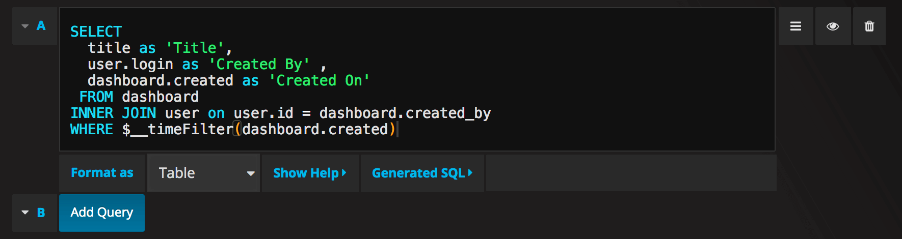
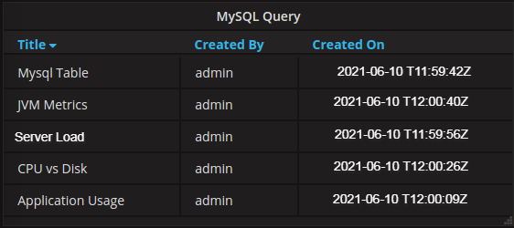

```{r setup, include=TRUE}
knitr::opts_chunk$set(echo = FALSE)
```

## Informacion de paradas de metro de Madrid

El lugar de donde se toma la información para analizar el Dataset relacionado con las paradas más relevantes dentro de Madrid provienen de la siguiente página:
<https://www.adictosaltrabajo.com/2019/10/30/leer-un-json-con-r-rstudio/>.

Lo primero que nosotros vamos a realizar será las peticiones API al servidor que contienen la información y algo muy importante es que las peticiones API las podemos hacer igual que una query SQL, pero en lugar de tener como resultado una dupla lo que vamos a tener es un archivo JSON. Esto permitiría cubrir los apartados de bases SQL Y JSON.
La API correspondientes base:
<https://idealista.carto.com:443/api/v2/sql?/>.

```{r, include=FALSE}
  library(jsonlite)
  library(curl)
  library(tidyverse)
```
## Peticion API para archivo JSON y parse a Data.frame
La parte del código que realiza la petición a una API, la cual retorna un archivo JSON que luego nosotros convertimos a una data.frame.

```{r, echo=TRUE}
q <- curl_escape("select ID, NAME, LINE, PLACE, LAT, LNG from public.paradas_metro_madrid")
uri_paradas_metro <- paste("https://idealista.carto.com/api/v2/sql?q=",q, sep="")
paradas_metro <- fromJSON(uri_paradas_metro)
paradas_metro <- paradas_metro[["rows"]]
```
## Sistena dinamico de tabla que ofrece Shiny de JSON.
En esta parte del código tenemos un "inputPanel" que es un simple panel de control para parámetros que luego usamos en la "RenderTabla", la cual toma los registros que cumplen con el "filter" de inputPanel.

```{r, echo=TRUE}
inputPanel(
  selectInput("n_breaks", label = "Station:",
              choices = c("L1","L2","L3","L4","L5","L6","L6","L7","L8","L9","L10"), selected = "L2")
)

renderTable({paradas_metro%>%filter(line==input$n_breaks)})

```

## Consultas de tabla

Si la opción Formatear como consulta está establecida en Tabla, básicamente puede realizar cualquier tipo de consulta SQL. El panel de la tabla mostrará automáticamente los resultados de las columnas y filas que devuelva su consulta.
{withd=20%}


```{r tabsets, echo=FALSE}
```
## Codigo de consulta
SELECT
  title as 'Title',
  user.login as 'Created By' ,
  dashboard.created as 'Created On'
 FROM dashboard
INNER JOIN user on user.id = dashboard.created_by
WHERE $__timeFilter(dashboard.created)
```{r}

```
## Tabla de Uso del sistema 
Puede controlar el nombre de las columnas del panel Tabla utilizando la sintaxis de selección de columna normal como SQL.
{withd=20%}
```{r}

```

## Markdown y shiny vs Grafana
La realidad de las herramientas usadas en la práctica es que las 2 tienen una gran utilidad, pero lo que pudimos observar mi compañero y yo es que la relación de precio y utilidad, la ganadora es Markdown y chiny porque estas permiten generar un web dinámica para que el usuario pueda realizar la búsqueda de la información que considere relevante mientras que grafana es una herramienta para personas más especializada en la cual se comparte información entre especialistas en el ramo, mientras que la otra herramienta te permite crear una web que todos pueden entender.
